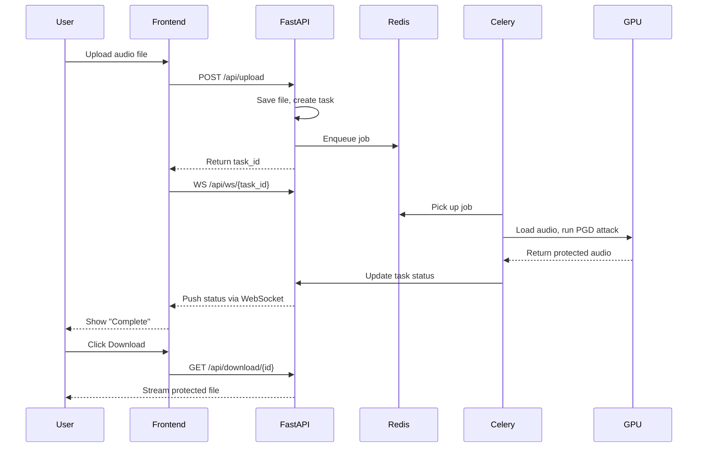

# AudioShield System Architecture

> Technical architecture for the AudioShield AI voice-cloning protection platform.

---

## High-Level Overview

```
┌─────────────────────────────────────────────────────────────────────────────┐
│                              USER (Artist)                                  │
└─────────────────────────────────────────────────────────────────────────────┘
                                     │
                                     ▼
┌─────────────────────────────────────────────────────────────────────────────┐
│                         FRONTEND (Next.js + React)                          │
│  ┌──────────────┐  ┌──────────────┐  ┌──────────────┐  ┌──────────────────┐ │
│  │  Dashboard   │  │  Upload UI   │  │  Vault/Lib   │  │    Settings      │ │
│  │  (Command    │  │  (The Forge) │  │  (History)   │  │                  │ │
│  │   Center)    │  │              │  │              │  │                  │ │
│  └──────────────┘  └──────────────┘  └──────────────┘  └──────────────────┘ │
└─────────────────────────────────────────────────────────────────────────────┘
                                     │
                              HTTP/WebSocket
                                     │
                                     ▼
┌─────────────────────────────────────────────────────────────────────────────┐
│                          BACKEND API (FastAPI)                              │
│  ┌────────────┐  ┌────────────┐  ┌────────────┐  ┌────────────────────────┐ │
│  │  /upload   │  │  /status   │  │  /download │  │   /auth (future)      │ │
│  └────────────┘  └────────────┘  └────────────┘  └────────────────────────┘ │
└─────────────────────────────────────────────────────────────────────────────┘
           │                │                              │
           │                ▼                              │
           │    ┌───────────────────┐                      │
           │    │   PostgreSQL      │                      │
           │    │   (Metadata DB)   │                      │
           │    └───────────────────┘                      │
           │                                               │
           ▼                                               ▼
┌─────────────────────────┐                    ┌─────────────────────────────┐
│       Redis             │◄──────────────────►│      File Storage           │
│   (Message Broker)      │                    │   (Local/S3 in future)      │
└─────────────────────────┘                    └─────────────────────────────┘
           │
           │ Job Queue (Celery)
           ▼
┌─────────────────────────────────────────────────────────────────────────────┐
│                         ML WORKER (Celery + PyTorch)                        │
│  ┌───────────────┐  ┌────────────────┐  ┌────────────────┐  ┌────────────┐ │
│  │ Audio Loader  │─►│ Chunker (<15s) │─►│ PGD Attacker   │─►│ Stitcher   │ │
│  │ (Torchaudio)  │  │                │  │ (HuBERT Model) │  │            │ │
│  └───────────────┘  └────────────────┘  └────────────────┘  └────────────┘ │
│                                                                             │
│  Hardware: NVIDIA RTX 3060/4050 (6GB VRAM) - pool=solo mode                │
└─────────────────────────────────────────────────────────────────────────────┘
```

---

## Component Details

### 1. Frontend (The Storefront)

| Layer | Technology | Purpose |
|-------|------------|---------|
| Framework | Next.js 14+ (React) | SSR, routing, SEO |
| Language | TypeScript | Type safety |
| Styling | Tailwind CSS | Glassmorphism, dark mode |
| Animations | Framer Motion | Scan animations, transitions |
| Charts | Recharts | Dashboard visualizations |
| Icons | Lucide React | UI iconography |

**Key Pages:**
- `/` - Dashboard (Command Center)
- `/protect` - Upload flow (The Forge)
- `/vault` - File library (The Vault)
- `/settings` - User preferences

---

### 2. Backend API (The Manager)

| Layer | Technology | Purpose |
|-------|------------|---------|
| Framework | FastAPI | Async API, auto-docs |
| Database | PostgreSQL | Task/file metadata |
| ORM | SQLAlchemy | DB abstraction |
| Validation | Pydantic | Request/response schemas |

**API Endpoints:**

```
POST   /api/upload          → Accept audio file, return task_id
GET    /api/status/{id}     → Return task status (queued/processing/done)
GET    /api/download/{id}   → Return protected file
DELETE /api/task/{id}       → Cancel/cleanup task
WS     /api/ws/{id}         → Real-time status updates
```

**Database Schema:**

```sql
-- tasks table
CREATE TABLE tasks (
    id              UUID PRIMARY KEY,
    original_name   VARCHAR(255),
    file_path       VARCHAR(512),
    status          VARCHAR(20),  -- queued, processing, completed, failed
    created_at      TIMESTAMP,
    processed_at    TIMESTAMP,
    output_path     VARCHAR(512),
    error_message   TEXT
);
```

---

### 3. ML Worker (The Factory)

| Layer | Technology | Purpose |
|-------|------------|---------|
| Task Queue | Celery | Background job execution |
| Broker | Redis | Job message passing |
| ML Framework | PyTorch | Gradient computations |
| Audio I/O | Torchaudio | GPU-accelerated audio loading |
| Target Model | HuBERT (HuggingFace) | Model to attack |

**Processing Pipeline:**

```
┌──────────────┐    ┌──────────────┐    ┌──────────────┐    ┌──────────────┐
│   Load WAV   │───►│  Split into  │───►│  PGD Attack  │───►│   Stitch     │
│  (torchaudio)│    │  <15s chunks │    │  per chunk   │    │   chunks     │
└──────────────┘    └──────────────┘    └──────────────┘    └──────────────┘
                                               │
                                               ▼
                                    ┌──────────────────────┐
                                    │ HuBERT Feature       │
                                    │ Extractor (Target)   │
                                    │                      │
                                    │ Perturbation Goal:   │
                                    │ Maximize feature     │
                                    │ extraction error     │
                                    └──────────────────────┘
```

**Adversarial Attack Logic (PGD):**

```python
# Pseudocode for Projected Gradient Descent attack
for iteration in range(num_steps):
    # Forward pass through HuBERT
    features = hubert_model(audio + perturbation)
    
    # Loss: maximize distance from original features
    loss = -mse_loss(features, original_features)
    
    # Backward pass
    loss.backward()
    
    # Update perturbation with gradient
    perturbation += alpha * perturbation.grad.sign()
    
    # Project back to epsilon ball (keep noise imperceptible)
    perturbation = torch.clamp(perturbation, -epsilon, epsilon)
```

---

### 4. Infrastructure (DevOps)

**Docker Compose Setup:**

```yaml
version: '3.8'
services:
  postgres:
    image: postgres:15
    environment:
      POSTGRES_DB: audioshield
      POSTGRES_USER: admin
      POSTGRES_PASSWORD: ${DB_PASSWORD}
    volumes:
      - pgdata:/var/lib/postgresql/data
    ports:
      - "5432:5432"

  redis:
    image: redis:7-alpine
    ports:
      - "6379:6379"

volumes:
  pgdata:
```

> **Note:** ML Worker runs natively (not in Docker) for direct GPU access.

---

## Data Flow



---

## Directory Structure

```
AudioShield/
├── frontend/                    # Next.js application
│   ├── src/
│   │   ├── app/                 # App router pages
│   │   ├── components/          # React components
│   │   │   ├── ui/              # Design system (glassmorphism)
│   │   │   ├── dashboard/       # Command Center widgets
│   │   │   ├── upload/          # The Forge components
│   │   │   └── vault/           # Library components
│   │   ├── lib/                 # Utilities, API client
│   │   └── styles/              # Tailwind config, globals
│   ├── public/                  # Static assets
│   └── package.json
│
├── backend/                     # FastAPI application
│   ├── app/
│   │   ├── main.py              # FastAPI app entry
│   │   ├── api/                 # Route handlers
│   │   │   ├── upload.py
│   │   │   ├── status.py
│   │   │   └── download.py
│   │   ├── models/              # SQLAlchemy models
│   │   ├── schemas/             # Pydantic schemas
│   │   ├── services/            # Business logic
│   │   └── core/                # Config, database
│   └── requirements.txt
│
├── worker/                      # Celery ML worker
│   ├── tasks/
│   │   ├── protect.py           # Main protection task
│   │   ├── chunker.py           # Audio splitting
│   │   ├── pgd_attack.py        # Adversarial attack
│   │   └── stitcher.py          # Audio reconstruction
│   ├── models/                  # HuBERT loader
│   ├── celery_app.py            # Celery configuration
│   └── requirements.txt
│
├── docker-compose.yml           # Redis + PostgreSQL
├── .env.example                 # Environment template
├── PRD.txt                      # Product requirements
├── dsign.txt                    # Design document
├── techStack.txt                # Technology choices
├── todo.md                      # Task breakdown
└── architecture.md              # This file
```

---

## VRAM Management Strategy

| Constraint | Solution |
|------------|----------|
| 6GB VRAM limit | Chunk audio into <15s segments |
| OOM prevention | `pool=solo` (1 job per worker) |
| Batch processing | Sequential chunk processing |
| Memory cleanup | Explicit `torch.cuda.empty_cache()` |

---

## Security Considerations

| Concern | Implementation |
|---------|---------------|
| File privacy | Auto-delete after 1 hour (cron job) |
| No training on data | Files never used for model training |
| Input validation | Pydantic file type/size checks |
| Rate limiting | FastAPI middleware (future) |

---

## Future Scalability

| Phase | Enhancement |
|-------|-------------|
| MVP → Beta | Add WebSocket for real-time updates |
| Beta → V1 | S3/CloudFlare R2 for file storage |
| V1 → V2 | Kubernetes for horizontal scaling |
| V2+ | Multiple GPU workers, load balancing |

---

*Architecture Version: 1.0 | Last Updated: January 23, 2026*
